# grid

It's the backend of an Excel-like table using SQL/relational database.

If your company doesn't welcome any services from third-party providers like Google Sheets or Microsoft SharePoint, and the only database you can rely on is relational database, this project is probably what you're looking for.

Please click [here](https://github.com/EchoesInCoconut/grid-ui) to see the frontend.

The table includes below functions:

#### Create a table of any size

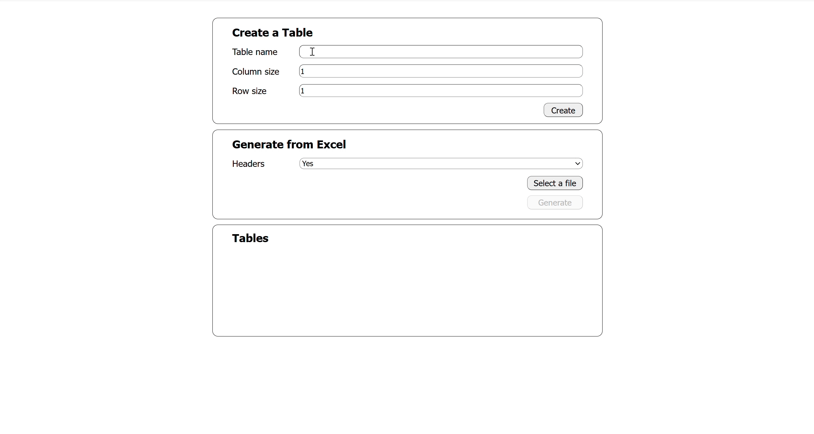

#### Import an Excel file

If you select Yes for Headers, the first row of the file will be identified as headers.

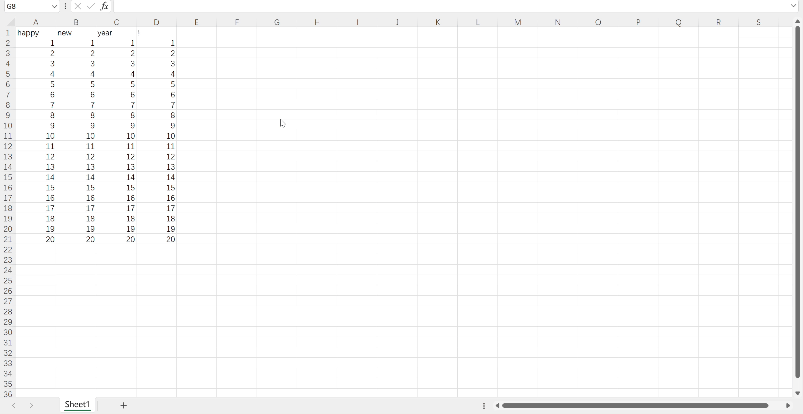

If you select No for Headers, the first row of the file won't be identified as headers.

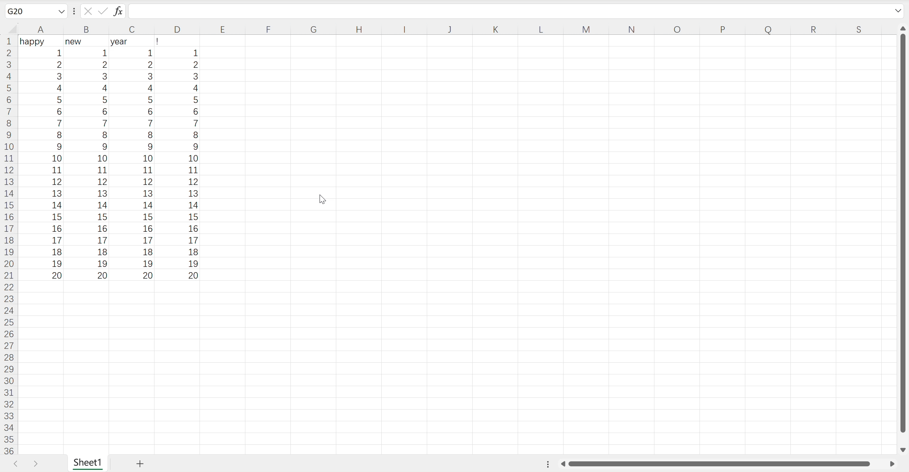

#### Insert a column/row

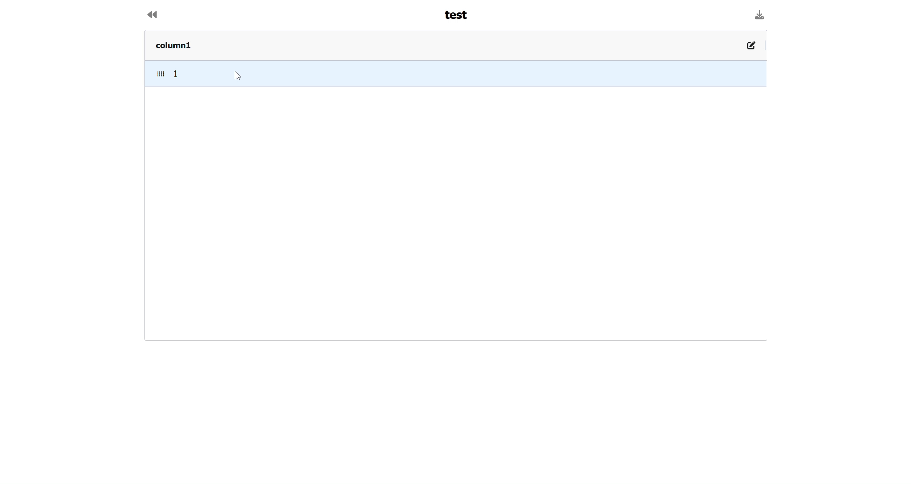

#### Delete a column/row

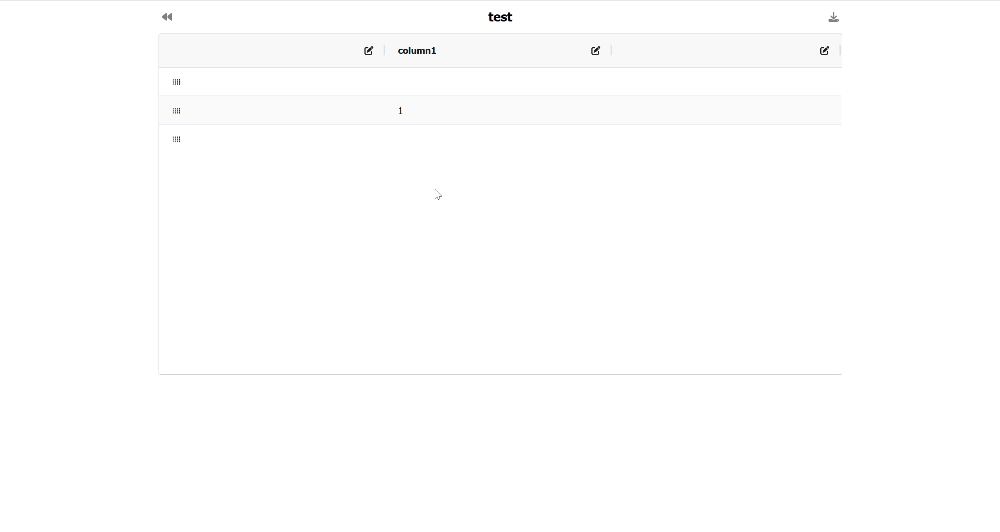

#### Drag a column/row

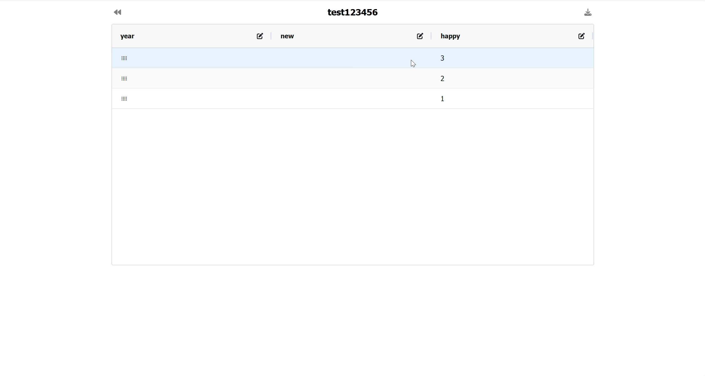

#### Rename a column

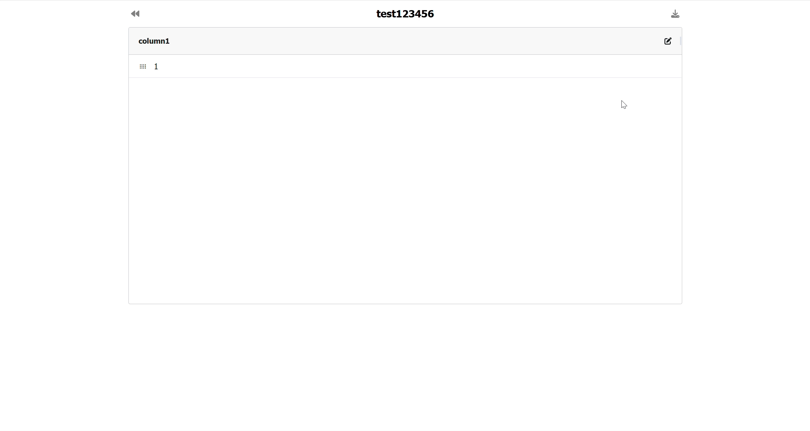

#### Sort data in a column

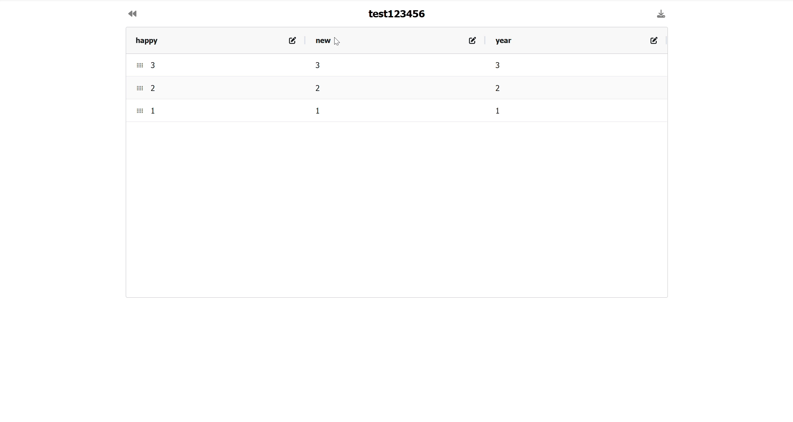

#### Update a cell

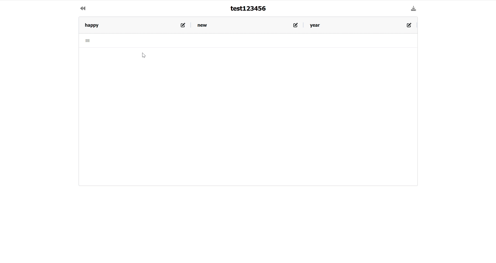

#### Rename a table

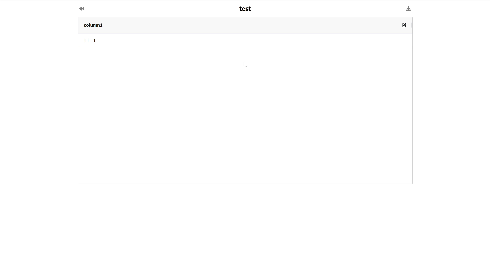

#### Export as an Excel file

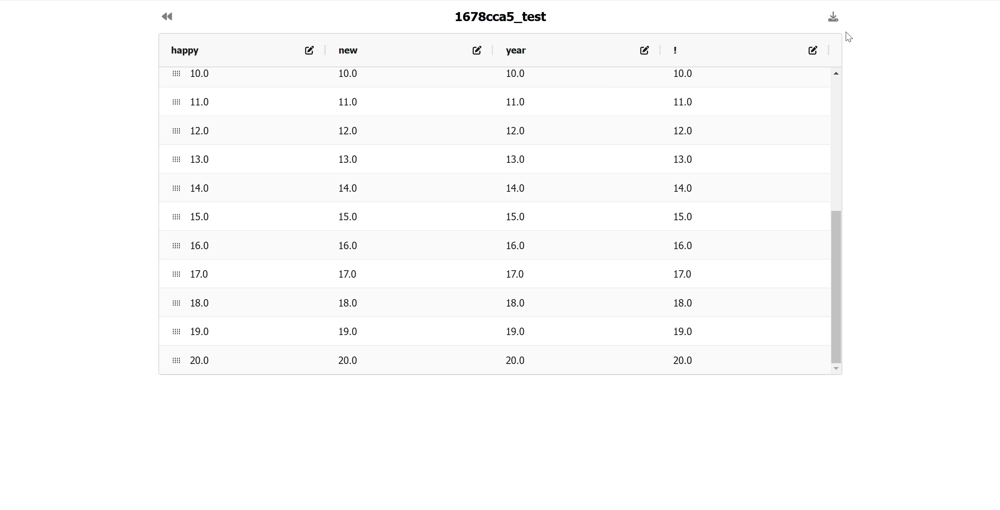

#### Delete a table

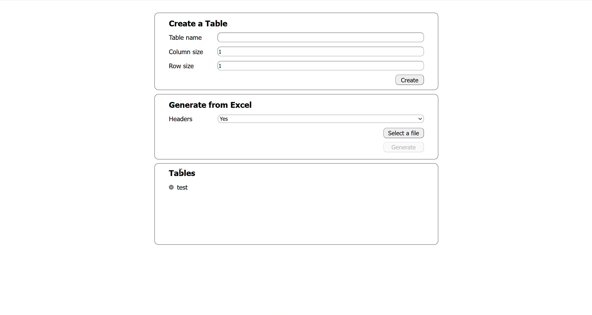
